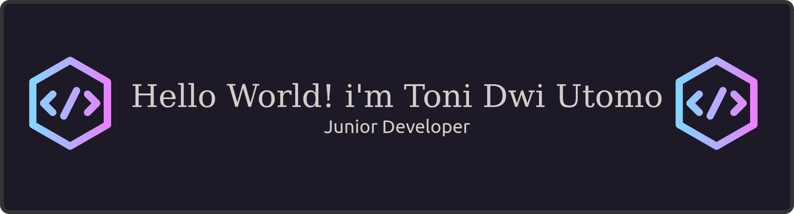

  

#### Hello World! i'm Toni Dwi Utomo 👋
<!--
**tonidwi/tonidwi** is a ✨ _special_ ✨ repository because its `README.md` (this file) appears on your GitHub profile.

Here are some ideas to get you started:

- 🔭 I’m currently working on ...
- 🌱 I’m currently learning ...
- 👯 I’m looking to collaborate on ...
- 🤔 I’m looking for help with ...
- 💬 Ask me about ...
- 📫 How to reach me: ...
- 😄 Pronouns: ...
- ⚡ Fun fact: ...
-->
- 🔭 "Sering salah ngetik, tapi benerinnya cepat kok."
- 🤔 "Hello, world! (Still learning the rest.)"
- 💬 "Programmer tanpa masa depan, tukang ngoding tanpa arah."
- 👯 "Just a human trying to make a robot friend."
- ⚡ "Code > social life." 
- 🌱 I’m currently learning Java language
- 😄😄

##### Favorite Programming Language

       

##### Connect with me

     

##### Play With Me

<picture>
  <source media="(prefers-color-scheme: dark)" srcset="https://raw.githubusercontent.com/tonidwi/tonidwi/output/pacman-contribution-graph-dark.svg">
  <source media="(prefers-color-scheme: light)" srcset="https://raw.githubusercontent.com/tonidwi/tonidwi/output/pacman-contribution-graph.svg">
  
</picture>

###

 

###

  

###

##### 📊 GitHub Stats:
 
 

##### 🏆 GitHub Trophies

##### ✍️ Random Dev Quote

##### 🔝 Top Contributed Repo

---

